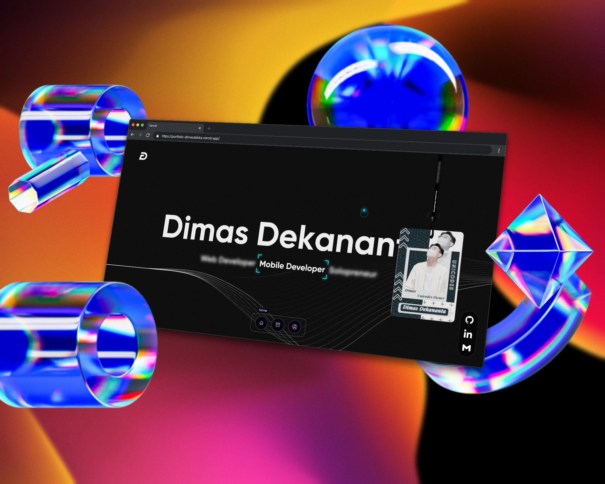

# Portfolio - Dimas Dekananta



A modern, interactive portfolio website built with Next.js, featuring 3D animations, smooth transitions, and a clean, professional design.

## ✨ Features

- **Interactive 3D Elements**:
  - Physics-based **Lanyard** component using Three.js and Rapier
  - **Threads** background animation with mouse interaction
  - **Circular Gallery** for project archives
- **Advanced Text Animations**:
  - **FallingText** with Matter.js physics
  - **TrueFocus**, **BlurText**, and **ScrollVelocity** effects
- **Performance Optimized**:
  - Dynamic imports for heavy components
  - `IntersectionObserver` to pause off-screen animations
  - `useMediaQuery` for responsive conditional rendering
- **Modern UI/UX**:
  - Custom cursor with spring animations
  - Glassmorphism effects and noise textures
  - Dock-style navigation
  - Fully responsive mobile-first design
- **Type-Safe**: Built with TypeScript for robust code quality

## 🚀 Tech Stack

- **Framework**: [Next.js 16 (Turbopack)](https://nextjs.org/)
- **UI Library**: [React 19](https://react.dev/)
- **Styling**: [Tailwind CSS 4](https://tailwindcss.com/)
- **Animations**:
  - [Framer Motion](https://www.framer.com/motion/)
  - [GSAP](https://greensock.com/gsap/)
- **3D & Physics**:
  - [Three.js](https://threejs.org/)
  - [@react-three/fiber](https://docs.pmnd.rs/react-three-fiber)
  - [@react-three/drei](https://github.com/pmndrs/drei)
  - [@react-three/rapier](https://github.com/pmndrs/react-three-rapier)
  - [Matter.js](https://brm.io/matter-js/)
- **Language**: [TypeScript](https://www.typescriptlang.org/)
- **Tooling**: ESLint, Prettier, Husky

## 📦 Installation

### Prerequisites

- Node.js 20.x or higher
- npm or yarn package manager

### Setup

1. **Clone the repository**

   ```bash
   git clone https://github.com/dimasdekka/portfolio.git
   cd portfolio
   ```

2. **Install dependencies**

   ```bash
   npm install
   ```

3. **Run development server**

   ```bash
   npm run dev
   ```

4. **Open your browser**
   Navigate to [http://localhost:3000](http://localhost:3000)

## 📁 Project Structure

```
portfolio/
├── src/
│   ├── app/              # Next.js app directory
│   │   ├── Archive/      # Projects archive page
│   │   ├── page.tsx      # Main homepage
│   │   ├── layout.tsx    # Root layout & global providers
│   │   └── globals.css   # Global styles & Tailwind
│   ├── blocks/           # Complex UI blocks
│   │   ├── Backgrounds/  # Threads, etc.
│   │   ├── Components/   # Dock, CircularGallery, etc.
│   │   └── TextAnimations/ # FallingText, BlurText, etc.
│   ├── components/       # Reusable components
│   │   ├── ui/           # Generic UI elements (ProfileCard, etc.)
│   │   ├── ExperienceTimeline.tsx
│   │   ├── Lanyard.tsx
│   │   └── ProjectCard.tsx
│   ├── data/            # Static data content
│   ├── hooks/           # Custom hooks (useMediaQuery, etc.)
│   ├── lib/             # Utilities and constants
│   ├── types/           # TypeScript definitions
│   └── fonts/           # Local fonts
├── public/              # Static assets
└── ...config files (next.config.ts, tailwind.config.js, etc.)
```

## 🎨 Customization

### Adding Projects

Edit `src/data/projects.ts`:

```typescript
{
  id: 4,
  number: '04',
  title: 'Your Project',
  category: 'Web Development',
  description: 'Project description',
  techstack: ['/techstack/icon.svg'],
  imageSrc: '/proj/project.svg',
  link: 'https://github.com/username/repo',
}
```

### Adding Skills

Edit `src/data/skills.ts`:

```typescript
export const devSkills: Skill[] = [
  { name: 'Your Skill', category: 'development' },
  // ...
];
```

### Updating Personal Information

Edit `src/constants/index.ts`:

```typescript
export const USER_INFO = {
  NAME: 'Your Name',
  HANDLE: 'yourhandle',
  GITHUB_USERNAME: 'yourusername',
  // ...
} as const;
```

## 🤝 Contributing

Contributions are welcome! Please read [CONTRIBUTING.md](CONTRIBUTING.md) for details on our code of conduct and the process for submitting pull requests.

### Development Workflow

1. Fork the repository
2. Create a feature branch: `git checkout -b feature/amazing-feature`
3. Make your changes following our coding standards
4. Commit using conventional commits: `git commit -m 'feat: add amazing feature'`
5. Push to the branch: `git push origin feature/amazing-feature`
6. Open a Pull Request

### Code Quality

This project uses:

- **ESLint** for code linting
- **Prettier** for code formatting
- **Husky** for pre-commit hooks
- **TypeScript** for type safety

Pre-commit hooks will automatically run linting and type checking before each commit.

## 📄 License

This project is open source and available under the [MIT License](LICENSE).

## 👤 Author

**Dimas Dekananta**

- GitHub: [@dimasdekka](https://github.com/dimasdekka)
- LinkedIn: [Dimas Dekananta](https://www.linkedin.com/in/dimas-dekananta)

## 🙏 Acknowledgments

- Design inspiration from modern portfolio websites
- 3D lanyard component inspired by physics-based interactions
- Animation techniques from Framer Motion community

---

⭐ If you found this project helpful, please consider giving it a star!
